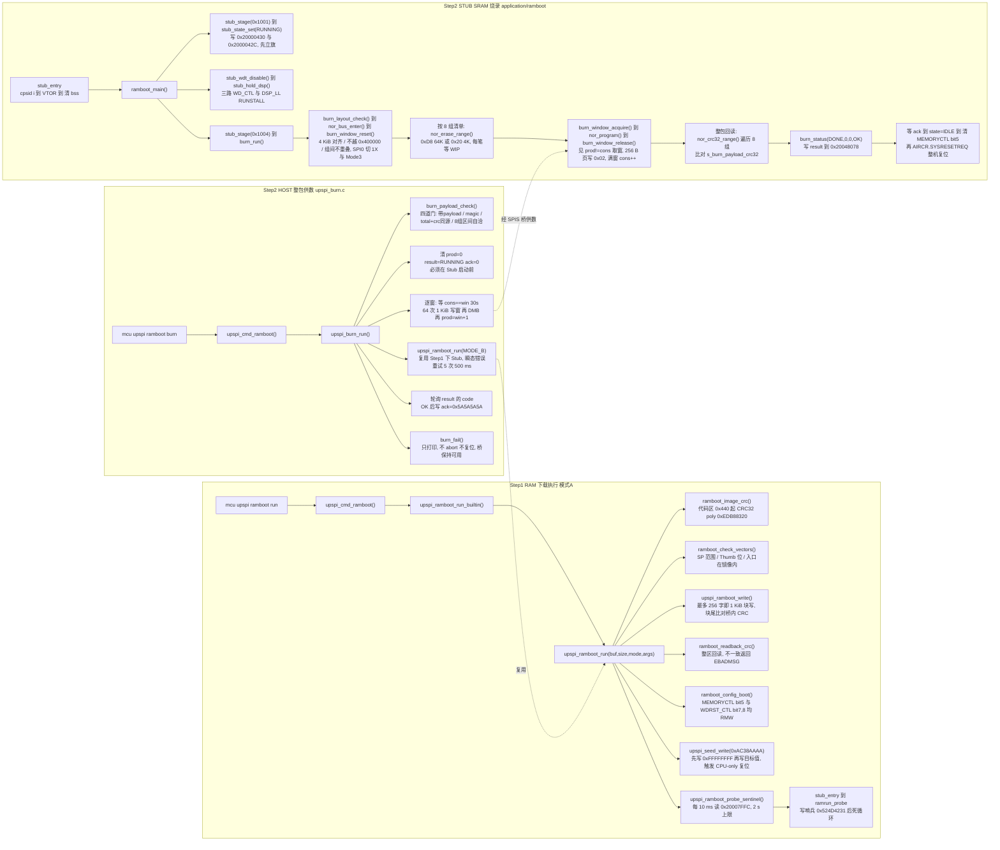

```mermaid
flowchart LR
  subgraph S1["Step1 RAM 下载执行 模式A"]
    A0["mcu upspi ramboot run"] --> A1["upspi_cmd_ramboot()"]
    A1 --> A2["upspi_ramboot_run_builtin()"]
    A2 --> A3["upspi_ramboot_run(buf,size,mode,args)"]
    A3 --> A4["ramboot_image_crc()<br/>代码区 0x440 起 CRC32 poly 0xEDB88320"]
    A3 --> A5["ramboot_check_vectors()<br/>SP 范围 / Thumb 位 / 入口在镜像内"]
    A3 --> A6["upspi_ramboot_write()<br/>最多 256 字即 1 KiB 块写, 块尾比对桥内 CRC"]
    A3 --> A7["ramboot_readback_crc()<br/>整区回读, 不一致返回 EBADMSG"]
    A3 --> A8["ramboot_config_boot()<br/>MEMORYCTL bit5 与 WDRST_CTL bit7,8 均 RMW"]
    A3 --> A9["upspi_seed_write(0xAC38AAAA)<br/>先写 0xFFFFFFFF 再写目标值, 触发 CPU-only 复位"]
    A3 --> AA["upspi_ramboot_probe_sentinel()<br/>每 10 ms 读 0x20007FFC, 2 s 上限"]
    AA --> AB["stub_entry 到 ramrun_probe<br/>写哨兵 0x524D4231 后死循环"]
  end
  subgraph S2H["Step2 HOST 整包供数 upspi_burn.c"]
    B0["mcu upspi ramboot burn"] --> B1["upspi_cmd_ramboot()"]
    B1 --> B2["upspi_burn_run()"]
    B2 --> B3["burn_payload_check()<br/>四道门: 带payload / magic / total+crc同源 / 8组区间自洽"]
    B2 --> B4["清 prod=0 result=RUNNING ack=0<br/>必须在 Stub 启动前"]
    B2 --> B5["upspi_ramboot_run(MODE_B)<br/>复用 Step1 下 Stub, 瞬态错误重试 5 次 500 ms"]
    B2 --> B6["逐窗: 等 cons==win 30s<br/>64 次 1 KiB 写窗 再 DMB 再 prod=win+1"]
    B2 --> B7["轮询 result 的 code<br/>OK 后写 ack=0x5A5A5A5A"]
    B2 --> B8["burn_fail()<br/>只打印, 不 abort 不复位, 桥保持可用"]
  end
  subgraph S2S["Step2 STUB SRAM 烧录 application/ramboot"]
    C0["stub_entry<br/>cpsid i 到 VTOR 到 清 bss"] --> C1["ramboot_main()"]
    C1 --> C2["stub_stage(0x1001) 到 stub_state_set(RUNNING)<br/>写 0x20000430 与 0x2000042C, 先立旗"]
    C1 --> C3["stub_wdt_disable() 到 stub_hold_dsp()<br/>三路 WD_CTL 与 DSP_LL RUNSTALL"]
    C1 --> C4["stub_stage(0x1004) 到 burn_run()"]
    C4 --> C5["burn_layout_check() 到 nor_bus_enter() 到 burn_window_reset()<br/>4 KiB 对齐 / 不越 0x400000 / 组间不重叠, SPI0 切 1X 与 Mode3"]
    C5 --> C6["按 8 组清单: nor_erase_range()<br/>0xD8 64K 或 0x20 4K, 每笔等 WIP"]
    C6 --> C7["burn_window_acquire() 到 nor_program() 到 burn_window_release()<br/>见 prod!=cons 取窗, 256 B 页写 0x02, 满窗 cons++"]
    C7 --> C8["整包回读: nor_crc32_range() 遍历 8 组<br/>比对 s_burn_payload_crc32"]
    C8 --> C9["burn_status(DONE,0,0,OK)<br/>写 result 到 0x20048078"]
    C9 --> CA["等 ack 到 state=IDLE 到 清 MEMORYCTL bit5<br/>再 AIRCR.SYSRESETREQ 整机复位"]
  end
  B5 -.复用.-> A3
  B6 -.经 SPIS 桥供数.-> C7

```