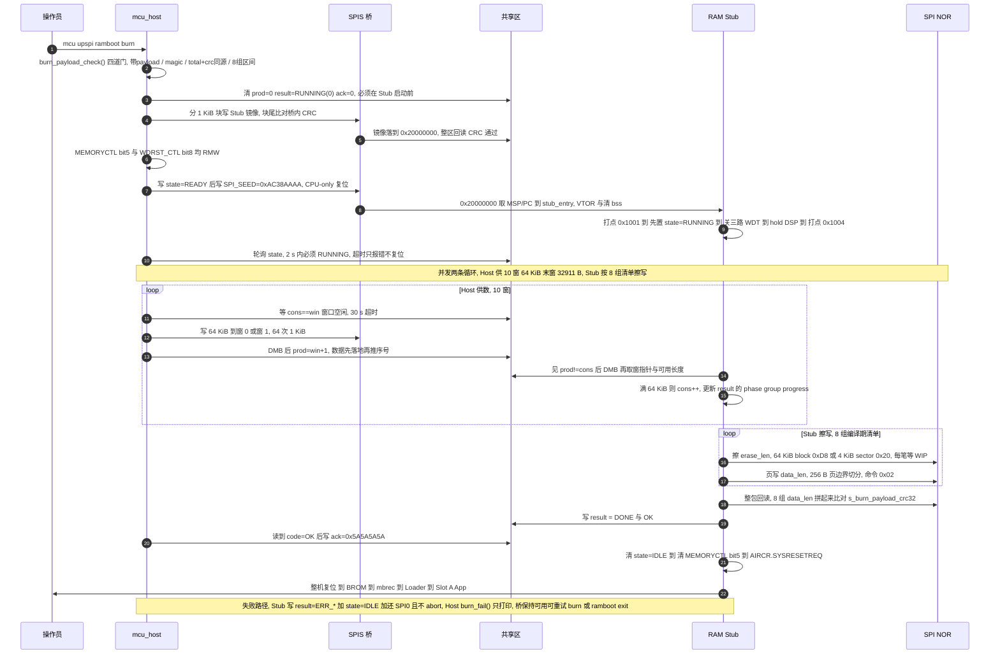

```mermaid
sequenceDiagram
  autonumber
  participant OP as 操作员
  participant H as mcu_host
  participant BR as SPIS 桥
  participant SH as 共享区
  participant ST as RAM Stub
  participant NOR as SPI NOR
  OP->>H: mcu upspi ramboot burn
  H->>H: burn_payload_check() 四道门, 带payload / magic / total+crc同源 / 8组区间
  H->>SH: 清 prod=0 result=RUNNING(0) ack=0, 必须在 Stub 启动前
  H->>BR: 分 1 KiB 块写 Stub 镜像, 块尾比对桥内 CRC
  BR->>SH: 镜像落到 0x20000000, 整区回读 CRC 通过
  H->>H: MEMORYCTL bit5 与 WDRST_CTL bit8 均 RMW
  H->>BR: 写 state=READY 后写 SPI_SEED=0xAC38AAAA, CPU-only 复位
  BR->>ST: 0x20000000 取 MSP/PC 到 stub_entry, VTOR 与清 bss
  ST->>ST: 打点 0x1001 到 先置 state=RUNNING 到 关三路 WDT 到 hold DSP 到 打点 0x1004
  H->>SH: 轮询 state, 2 s 内必须 RUNNING, 超时只报错不复位
  Note over H,NOR: 并发两条循环, Host 供 10 窗 64 KiB 末窗 32911 B, Stub 按 8 组清单擦写
  loop Host 供数, 10 窗
    H->>SH: 等 cons==win 窗口空闲, 30 s 超时
    H->>BR: 写 64 KiB 到窗 0 或窗 1, 64 次 1 KiB
    H->>SH: DMB 后 prod=win+1, 数据先落地再推序号
    ST->>SH: 见 prod!=cons 后 DMB 再取窗指针与可用长度
    ST->>ST: 满 64 KiB 则 cons++, 更新 result 的 phase group progress
  end
  loop Stub 擦写, 8 组编译期清单
    ST->>NOR: 擦 erase_len, 64 KiB block 0xD8 或 4 KiB sector 0x20, 每笔等 WIP
    ST->>NOR: 页写 data_len, 256 B 页边界切分, 命令 0x02
  end
  ST->>NOR: 整包回读, 8 组 data_len 拼起来比对 s_burn_payload_crc32
  ST->>SH: 写 result = DONE 与 OK
  H->>SH: 读到 code=OK 后写 ack=0x5A5A5A5A
  ST->>ST: 清 state=IDLE 到 清 MEMORYCTL bit5 到 AIRCR.SYSRESETREQ
  ST->>OP: 整机复位 到 BROM 到 mbrec 到 Loader 到 Slot A App
  Note over H,ST: 失败路径, Stub 写 result=ERR_* 加 state=IDLE 加还 SPI0 且不 abort, Host burn_fail() 只打印, 桥保持可用可重试 burn 或 ramboot exit

```